# xTool F1 Ultra - Laser

**Stranglega bannað er að nota tækið með hlífina opna!**

## Almenn notkun

Notið handfangið á græna glerinu til að lyfta því upp og niður. Ekki leggja neitt ofan á tækið. Ekki vera með neinn vökva eða matvæli í nánd við tækið.

## Snúningstól

***TODO***

## Rafrásagerð

## Ath: Skjal í vinnslu

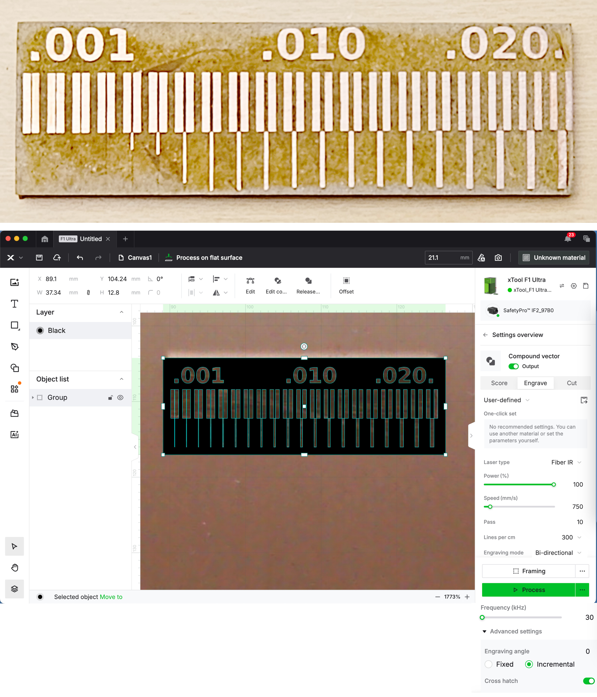

### Hlekkir: 

- 1: [mikeysklar](https://github.com/mikeysklar/cnc-fiber-laser-pcb)
- 2: [sphawes](https://github.com/sphawes/fiber-laser-pcb-fab)

### Styttri skref

#### KiCad 

- Kicad -> plot -> svg -> Negative plot

#### Inkscaep

- Inkscape -> Select all -> ungroup oft. 
- Velja allt hvíta og gera "Stroke to path"
- Með allt hvíta valið, gera ctrl + "+" (Path -> Union)
- Aðlaga stærðina á svarta bakgrunninn, velja allt og gera ctrl + "-" (Path -> Difference)

Xtool stillingar:

- FIBER IR
- Power 100%
- Speed 700
- Passes 10
- Lines per cm: 140
- Bi-directional
- Incremental
- Cross-hatch
- Autofocus + 1.5mm (Handvirkt, á stjórnborðinu, ekki stimpla inn í forritið)

### Leiðbeiningar á íslensku:

    Höfundar: Jóhann Ernir og Kristján Örn - nemendur í rafeindavirkjun 2025
    Uppfært: Árni Björnsson

#### Kicad

Eftir að hafa teiknað rásina þína í [KiCAD](http://kicad.org/), þá viltu bæta við **polygons**. 

Með því velur þú þessa valkosti:​ (eftir að ýta á OK þarftu að ýta á B takkann á lyklaborðinu) 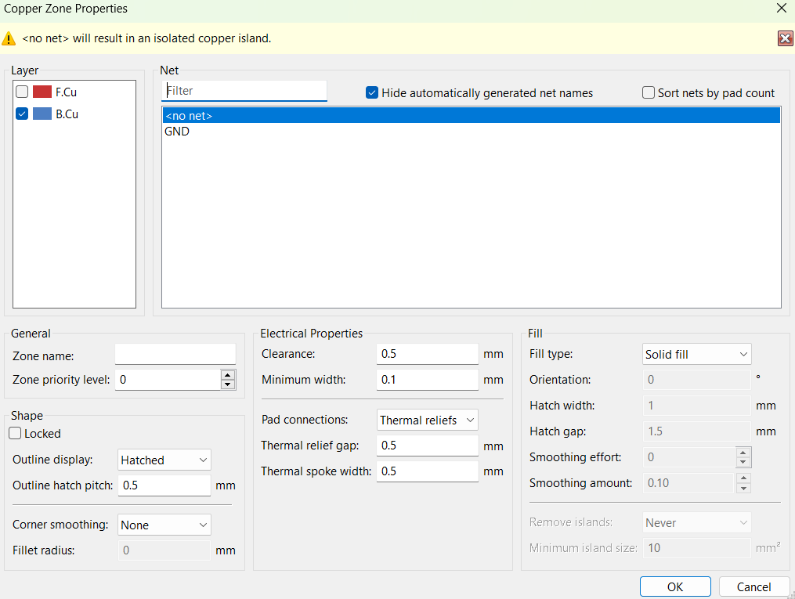

Þá ætti platan þín að líta svona út:

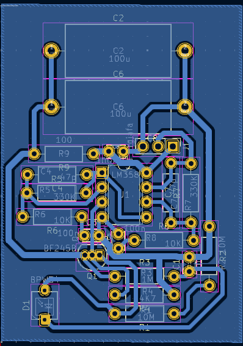

Ef þú vilt svo færa línur fram og til baka til að eyjurnar tengist, getur þú gert það. Til að upppfæra ýtir þú á **plot** takkann.  og þá getur þú uppfært útlitið.

Best er að hafa sem flestar eyjar tengdar.

Svo ýtir þú á **Plot** og plottar skjalið sem **SVG**.

#### Inkscape

Næst þarftu að nota [Inkscape](https://inkscape.org/) og fylgja þessum skrefum:

Fyrsta sem þú gerir er að ýta á **File** og svo **Import**, velur svo skjalið sem kom úr KiCAD, það ætti að vera **SVG**. Næstu atriði þarf að gera í réttri röð.

1. Gera **CTRL + A**, hægri smella og velja **ungroup**.

2. Velja allt á skjánum með **CTRL + A** og fer í Path og geria **Object to path** og **stroke to path**. Gott er að gera bæði nokkrum sinnum, bara til öryggis.

3. Eftir það velur þú **Node** tólið  og dregur yfir alla punktana þannig að þeir verða bláir. 

4. Velur svo **Path**, velur **Union**. 

5. Með alla punktana valda gerir þú **CTRL + K**

6. Eftir það velur þú alla ytri punktana, eins og sést á myndina hér fyrir neðan, og eyðir þeim með **Backspace** eða **Delete** takkanum á lyklaborðinu.

##### Allir ystu punktar valdir​

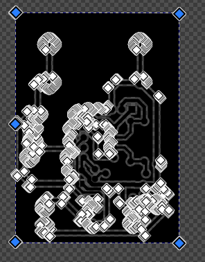

##### Eftir að hafa eytt þeim​

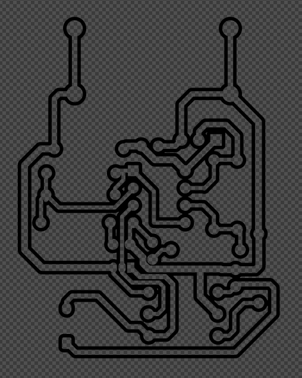

#### Athugið:

Passa að allir eru valdir þegar það er gert allt með **path**, aldrei hægt að gera nógu mikið af **CTRL + A** og svo líka aldrei of mikið af **Object to path** og **stroke to path**.

Stundum er þetta aðeins leiðinlegt og gerir það ekki, en á endanum virkar það.

Svo exportar þú skjalinu sem **SVG** og geymir það þannig fyrir laserskurðarvélina.

Oft virkar þetta ekki ef þú ert með **vias holes**, þau tengjast **polygons** og þá getur maður ekki eitt ystu punktunum. Mælt er með að skipta þeim út fyrir 1x1 **dupont footprints** og láta það nægja.

#### Bora göt

Annaðhvort er hægt að bora götin handvikt eða nota CNC fræs. Fræsinn er mikið svalari.

Þá plottar þú út skjalið sem **Gerber** með eftirfarandi stillingum:

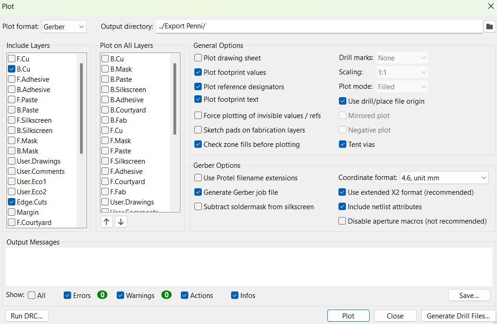

Og svo ýtir þú á **Generate drill files** og notar þessar stillingar:

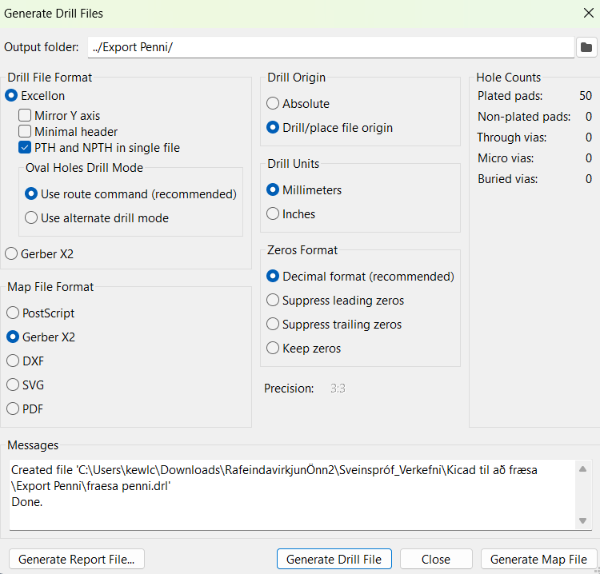

#### Carbide copper (fyrir holur)

Síðan opnar þú heimasíðuna [Carbide copper](https://carbide3d.com/copper/) og fylgir þessum leiðbeningum

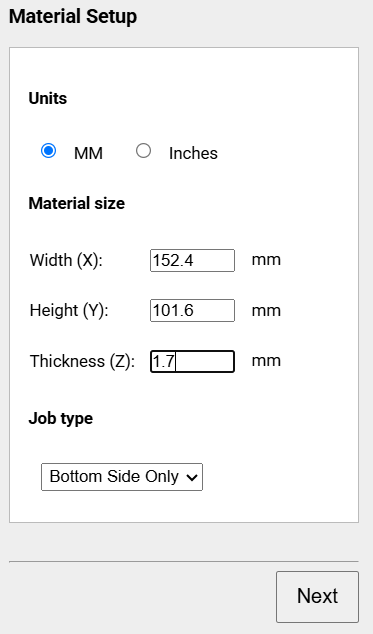

Fyrst velur þú **B.cu** skjalið og síðan **drill file** skjalið. **Edge cuts** skipta ekki máli í þessu. Á endanum velur þú: **Export as separate G Codes**

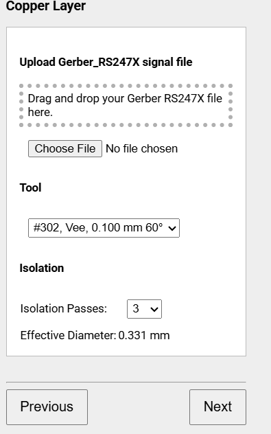
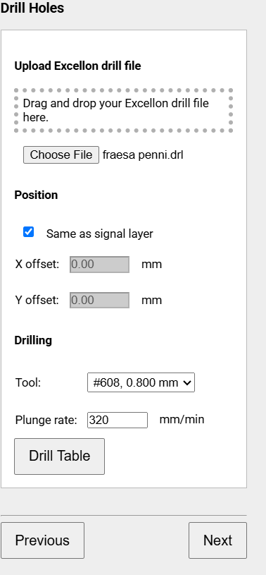

Síðan borar þú út gotin með fræsinum og færir plötuna yfir í laser skurðarvélina.

Góðar ábendingar:
   1.​ Festa plötuna vel
   2.​ Muna að núllstilla **Z** ásinnn
   3.​ **Ryksuga eftir sig**

#### Laser vél

Fyrst staðsetur þú plötu þína í vélinni og ýtir svo á ​ í xTool forritinu. Eftir það ætti að koma mynd af plötunni þinni í forritinu. 

Síðan ýtir þú á  og velur SVG skjalið sem þú varst að búa til úr **Inkscape**. Mikilvægt er að staðsetja teikninguna rétt yfir holunum. 

Því miður er ekki hægt að treysta myndavélinni alveg og þarf því að taka eina umferð til að staðsetja plötuna rétt.

Stillingarnar sem eru notaðar eru þessar:

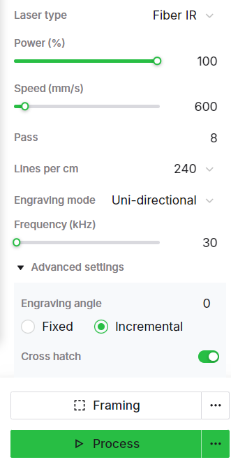

Passa að hafa **Fiber IR** valið

* **100% power**
* **600 mm/s hraða**
* **Passes: 8**, stundum 10-12.
* **Lines per cm:** 240
* **Engraving mode:** Uni-directional
* **Frequency: 30**
* **Advanced settings:** **Incremental & Cross hatch** 

Gott ráð er að þrífa plötuna vel með Ísóprópanóli fyrir skurð, minnstu óhreinindi og fita geta skemmt fyrir. 
