# xTool F1 Ultra - Laser

**Stranglega bannað er að nota tækið með hlífina opna!**

## Almenn notkun

__Ath: Skjalið er í vinnslu__

Notið handfangið á græna glerinu til að lyfta því upp og niður. Ekki leggja neitt ofan á tækið. Ekki vera með neinn vökva eða matvæli í nánd við tækið.

## Rafrásagerð

**Leiðbeiningar um hvernig á að gera rafrásir með götum má finna neðar í skjalinu.**

### KiCad && DXF

Einfalt er að færa rás úr KiCad yfir í xTool. Hér eru leiðbeiningar fyrir það.

Í KiCad **PCB Editor** velur þú **File -> Plot** og velur **DXF** sem Plot format. 

Haka við:

- **Plot graphic items using their contours**

- Nota **millimetra**

- Nota **Drill place file origin**

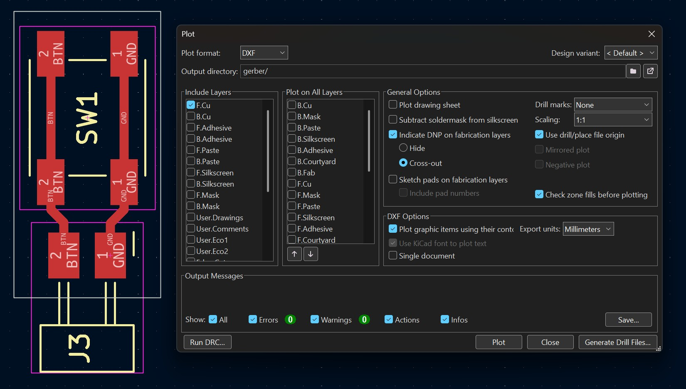

DXF má svo opna beint í xTool Studio sem er uppsett á tölvunni við xTool laserinn. 

Í xTool Studio byrjar þú að velja **New Project**

Gott ráð er að þrífa plötuna vel með Ísóprópanóli fyrir skurð, minnstu óhreinindi og fita geta skemmt fyrir. 

Þú staðsetur plötuna í vélinni, ofan á svörtu skurðarplötunni, þannig að rauði og blái punkturinn sé í miðjunni. 

Stillið fókusinn handvirkt þannig að punktarnir séu ofan á hvor öðrum. 

Takið mynd af vinnusvæðinu með myndarvélartákninu. Þá ætti að koma mynd af plötunni í forritinu.

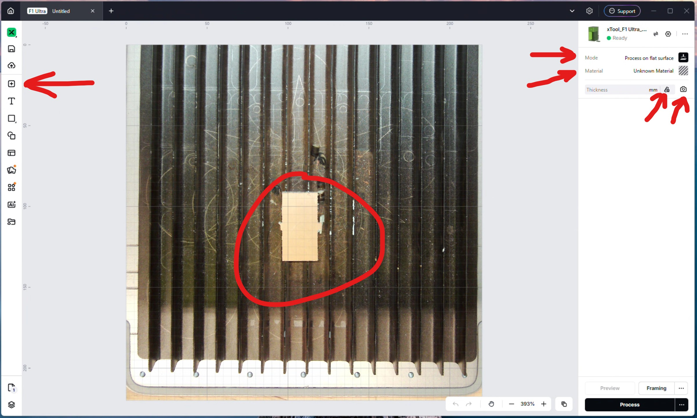

Smelltu núna á **Material** og veldu ""PCB rafásagerð"" og svo **Apply**. 

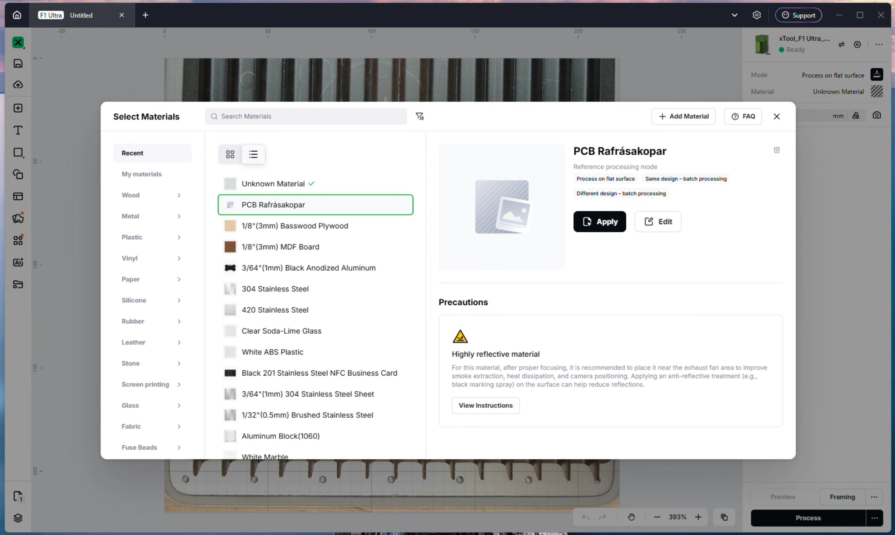

Svo velur þú **Import** og opnar DXF skjalið sem þú bjóst til í KiCad. Þá ætti að koma upp mynd af rásinni þinni í forritinu.

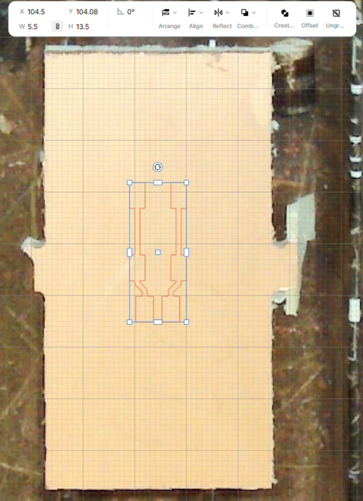

Næst þarf að gera kassa utan um rásina, t.d. horn í horn á brettinu sem þú ert að gera. Í sýnidæminu er notast við minni kassa.

Kassatólið er valið á verkfærastikunni og dregið yfir rásina. 

Veldu bæði kassann og rásina með því að halda inni **Shift** takkann og velja bæði. Þá getur þú gert **Create compound vector**. 

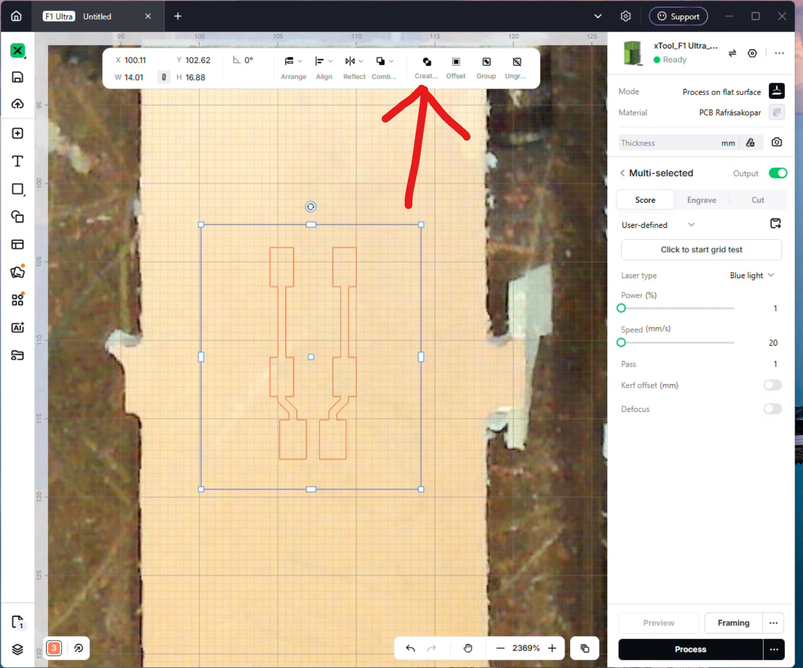

Gættu þess að rásin sé svört að lit. Ef þú þarft að breyta litnum, hægriklikkar þú þá rásina og velur svartan. 

Svo þarf að velja **Engrave**. Þá ætti þetta að líta svona út:

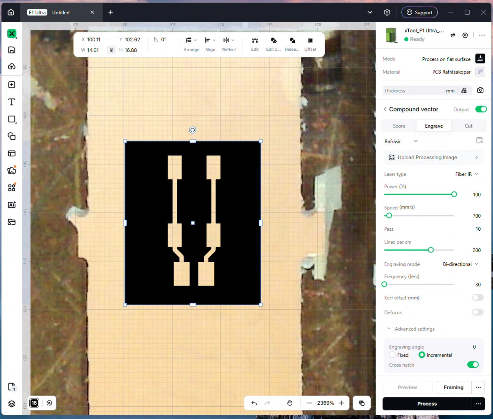

#### Xtool stillingar:

- FIBER IR
- Power 100%
- Speed 700
- Passes 10
- Lines per cm: 200
- Bi-directional
- Incremental
- Cross-hatch

Ýtið á **Process**, tölvan reiknar út ferilinn, ýtið svo á **Start**. Þegar skráin er komin yfir í vélina, pípir tækið og þú getur ýtt á stóra græna takkann til að byrja. 

**ATH: Hafið kveikt á soginu og hlífina alveg niðri!**

**ATH: Ef laserinn virðist lítið sem ekkert gera, þarf að stilla fókusinn!**

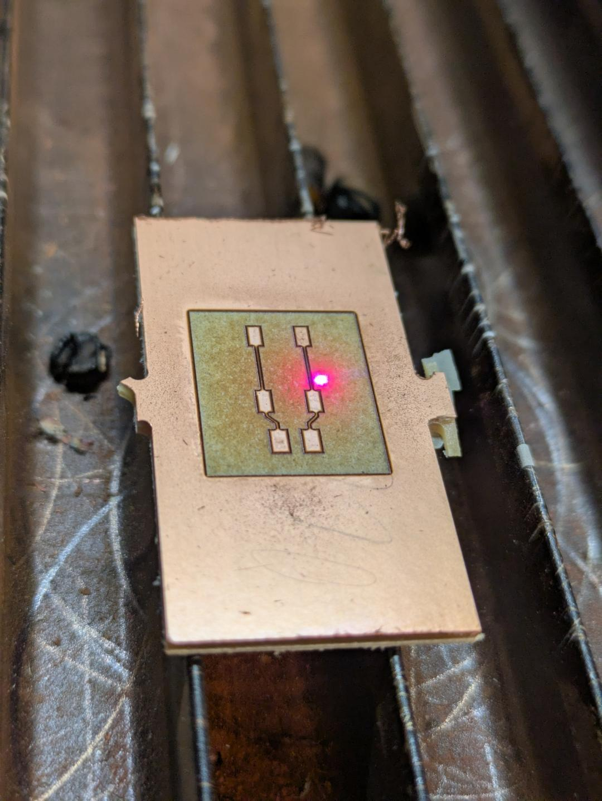

Skolið rásina létt í vaskinum og þurrkið vel. Gott er að nota Ísóprópanól til að þrífa rásina. 

#### Bora göt

Annaðhvort er hægt að bora götin handvikt eða nota CNC fræs. Fræsinn er mikið svalari.

Þá plottar þú út skjalið sem **Gerber** með eftirfarandi stillingum:

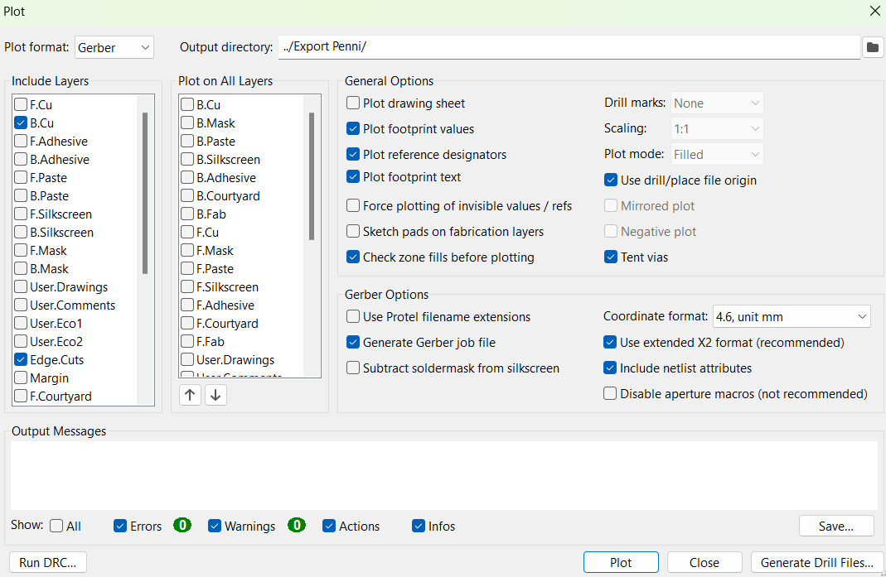

Og svo ýtir þú á **Generate drill files** og notar þessar stillingar:

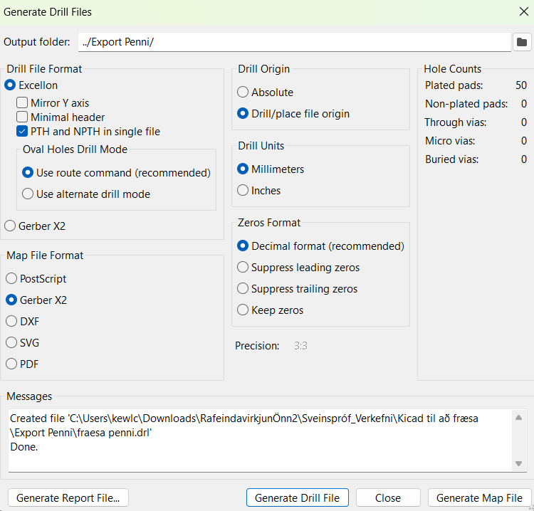

#### Carbide copper (fyrir holur)

Síðan opnar þú heimasíðuna [Carbide copper](https://carbide3d.com/copper/) og fylgir þessum leiðbeningum

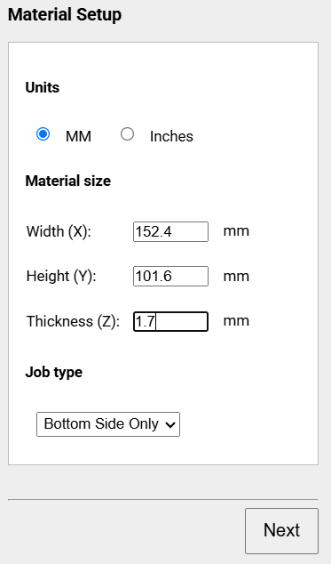

Fyrst velur þú **B.cu** skjalið og síðan **drill file** skjalið. **Edge cuts** skipta ekki máli í þessu. Á endanum velur þú: **Export as separate G Codes**

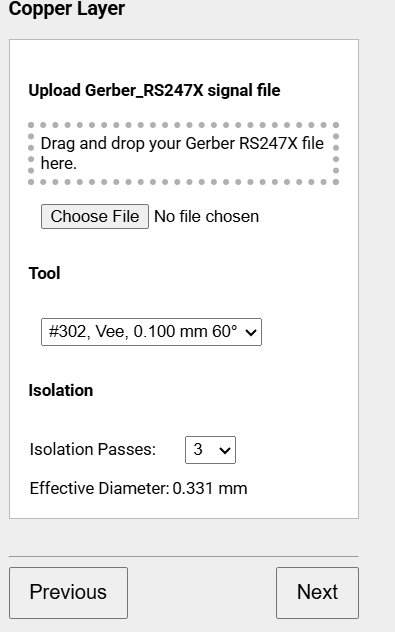

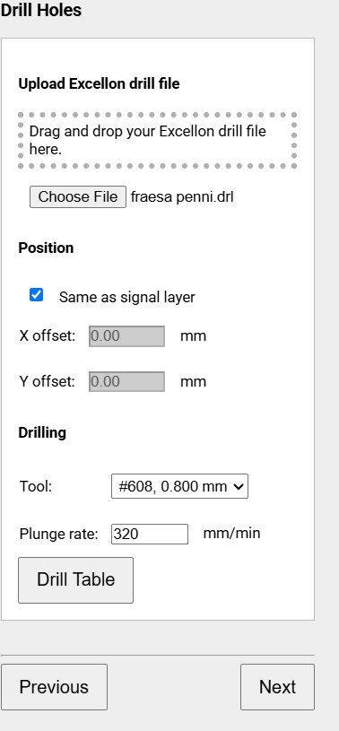

Síðan borar þú út gotin með fræsinum og færir plötuna yfir í laser skurðarvélina.

Góðar ábendingar:
   1.​ Festa plötuna vel

   2.​ Muna að núllstilla **Z** ásinn
   
   3.​ **Ryksuga eftir sig**

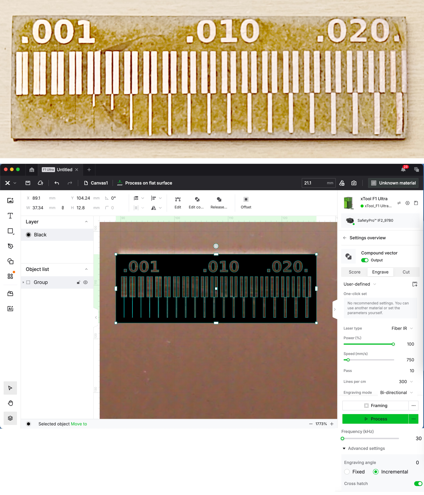

### Hlekkir: 

- 1: [mikeysklar](https://github.com/mikeysklar/cnc-fiber-laser-pcb)
- 2: [sphawes](https://github.com/sphawes/fiber-laser-pcb-fab)