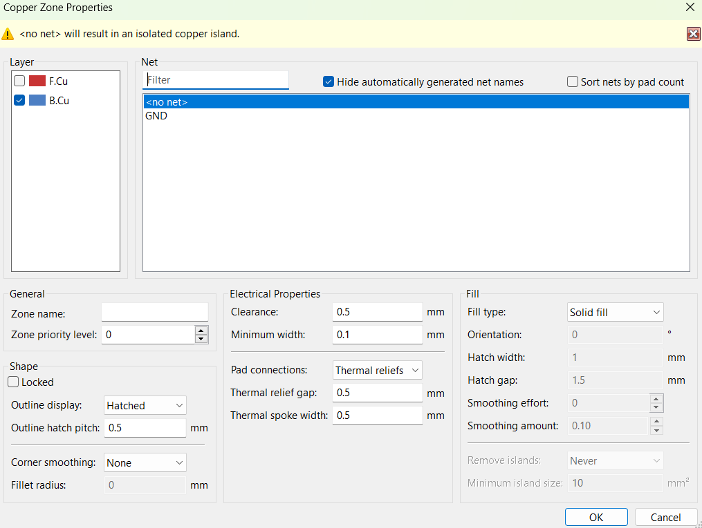
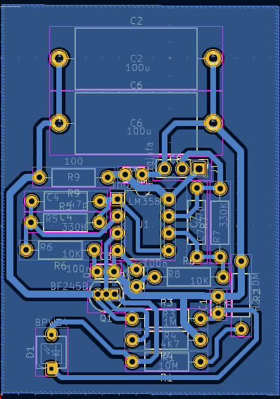
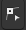
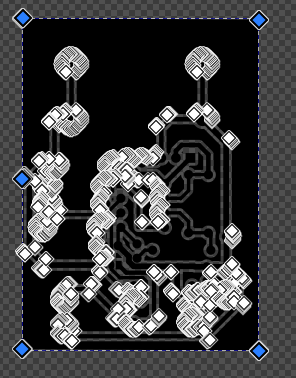
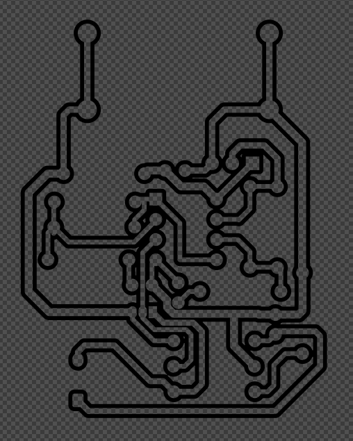
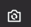
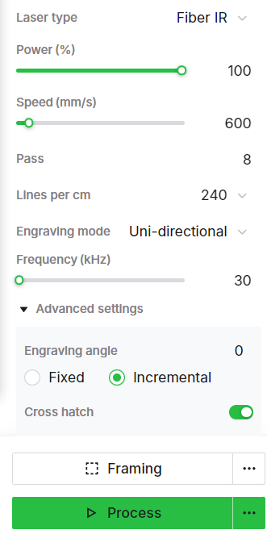

# xTool F1 Ultra - Laser

**Stranglega bannað er að nota tækið með hlífina opna!**

## Almenn notkun

__Ath: Skjalið er í vinnslu__

Notið handfangið á græna glerinu til að lyfta því upp og niður. Ekki leggja neitt ofan á tækið. Ekki vera með neinn vökva eða matvæli í nánd við tækið.

## Rafrásagerð

### KiCad && DXF

Einfalt er að færa rás úr KiCad yfir í xTool. Hér eru leiðbeiningar fyrir það.

Í KíCad PCB Editor velur þú **File -> Plot** og velur **DXF** 

Haka við:

- **Plot graphic items using their contours**

- Nota **millimetra**

- Nota **Drill place file origin**

DXF má svo opna beint í xTool Studio sem er uppsett á tölvunni við xTool laserinn. 

Í xTool Studio byrjar þú að velja **New Project**

Þú staðsetur plötuna í vélinni, ofan á svörtu skurðarplötunni, þannig að rauði og blái punkturinn sé í miðjunni. 

Stillið fókusinn handvirkt þannig að punktarnir séu ofan á hvor öðrum. 

Takið mynd af vinnusvæðinu með myndarvélartákninu. Þá ætti að koma mynd af plötunni í forritinu.

Smelltu núna á **Material** og veldu ""PCB rafásagerð"" og svo **Apply**. 

Svo velur þú **Import** og opnar DXF skjalið sem þú bjóst til í KiCad. Þá ætti að koma upp mynd af rásinni þinni í forritinu.

Næst þarf að gera kassa utan um rásina, t.d. horn í horn á brettinu sem þú ert að gera. Í sýnidæminu er notast við minni kassa.

Kassatólið er valið á verkfærastikunni og dregið yfir rásina. 

Veldu bæði kassann og rásina með því að halda inni **Shift** takkann og velja bæði. Þá getur þú gert **Create compound vector**. 

Gættu þess að rásin sé svört að lit. Ef þú þarft að breyta litnum, hægriklikkar þú þá rásina og velur svartan. 

Svo þarf að velja **Engrave**. Þá ætti þetta að líta svona út:

#### Xtool stillingar:

- FIBER IR
- Power 100%
- Speed 700
- Passes 10
- Lines per cm: 200
- Bi-directional
- Incremental
- Cross-hatch

Ýtið á **Process**, tölvan reiknar út ferilinn, ýtið svo á **Start**. Þegar skráin er komin yfir í vélina, pípir tækið og þú getur ýtt á stóra græna takkann til að byrja. 

**ATH: Hafið kveikt á soginu og hlífina alveg niðri!**

**ATH: Ef laserinn virðist lítið sem ekkert gera, þarf að stilla fókusinn!**

## Snúningstól

***TODO***

This needs to be finished. 

### Leiðbeiningar á íslensku:

    Höfundar: Jóhann Ernir og Kristján Örn - nemendur í rafeindavirkjun 2025
    Uppfært: Árni Björnsson

### Styttri skref

#### KiCad 

- Kicad -> plot -> svg -> Negative plot

#### Inkscape

- Inkscape -> Select all -> ungroup oft. 
- Velja allt hvíta og gera "Stroke to path"
- Með allt hvíta valið, gera ctrl + "+" (Path -> Union)
- Aðlaga stærðina á svarta bakgrunninn, velja allt og gera ctrl + "-" (Path -> Difference)

#### Kicad - SVG

Eftir að hafa teiknað rásina þína í [KiCAD](http://kicad.org/), þá viltu bæta við **polygons**. 

Með því velur þú þessa valkosti:​ (eftir að ýta á OK þarftu að ýta á B takkann á lyklaborðinu) 

Þá ætti platan þín að líta svona út:

Ef þú vilt svo færa línur fram og til baka til að eyjurnar tengist, getur þú gert það. Til að upppfæra ýtir þú á **plot** takkann.  og þá getur þú uppfært útlitið.

Best er að hafa sem flestar eyjar tengdar.

Svo ýtir þú á **Plot** og plottar skjalið sem **SVG**.

#### Inkscape

Næst þarftu að nota [Inkscape](https://inkscape.org/) og fylgja þessum skrefum:

Fyrsta sem þú gerir er að ýta á **File** og svo **Import**, velur svo skjalið sem kom úr KiCAD, það ætti að vera **SVG**. Næstu atriði þarf að gera í réttri röð.

1. Gera **CTRL + A**, hægri smella og velja **ungroup**.

2. Velja allt á skjánum með **CTRL + A** og fer í Path og geria **Object to path** og **stroke to path**. Gott er að gera bæði nokkrum sinnum, bara til öryggis.

3. Eftir það velur þú **Node** tólið  og dregur yfir alla punktana þannig að þeir verða bláir. 

4. Velur svo **Path**, velur **Union**. 

5. Með alla punktana valda gerir þú **CTRL + K**

6. Eftir það velur þú alla ytri punktana, eins og sést á myndina hér fyrir neðan, og eyðir þeim með **Backspace** eða **Delete** takkanum á lyklaborðinu.

##### Allir ystu punktar valdir​

##### Eftir að hafa eytt þeim​

#### Athugið:

Passa að allir eru valdir þegar það er gert allt með **path**, aldrei hægt að gera nógu mikið af **CTRL + A** og svo líka aldrei of mikið af **Object to path** og **stroke to path**.

Stundum er þetta aðeins leiðinlegt og gerir það ekki, en á endanum virkar það.

Svo exportar þú skjalinu sem **SVG** og geymir það þannig fyrir laserskurðarvélina.

Oft virkar þetta ekki ef þú ert með **vias holes**, þau tengjast **polygons** og þá getur maður ekki eitt ystu punktunum. Mælt er með að skipta þeim út fyrir 1x1 **dupont footprints** og láta það nægja.

#### Bora göt

Annaðhvort er hægt að bora götin handvikt eða nota CNC fræs. Fræsinn er mikið svalari.

Þá plottar þú út skjalið sem **Gerber** með eftirfarandi stillingum:

Og svo ýtir þú á **Generate drill files** og notar þessar stillingar:

#### Carbide copper (fyrir holur)

Síðan opnar þú heimasíðuna [Carbide copper](https://carbide3d.com/copper/) og fylgir þessum leiðbeningum

Fyrst velur þú **B.cu** skjalið og síðan **drill file** skjalið. **Edge cuts** skipta ekki máli í þessu. Á endanum velur þú: **Export as separate G Codes**

Síðan borar þú út gotin með fræsinum og færir plötuna yfir í laser skurðarvélina.

Góðar ábendingar:
   1.​ Festa plötuna vel

   2.​ Muna að núllstilla **Z** ásinnn
   
   3.​ **Ryksuga eftir sig**

#### Laser

Fyrst staðsetur þú plötu þína í vélinni og ýtir svo á ​ í xTool forritinu. Eftir það ætti að koma mynd af plötunni þinni í forritinu. 

Síðan ýtir þú á  og velur SVG skjalið sem þú varst að búa til úr **Inkscape**. Mikilvægt er að staðsetja teikninguna rétt yfir holunum. 

Því miður er ekki hægt að treysta myndavélinni alveg og þarf því að taka eina umferð til að staðsetja plötuna rétt.

**Mikilvægt:** Nauðsynlegt er að handstilla fókusinn eftir að hafa notað *autofocos*. Gott er að miða við að hækka um 3mm. 

Stillingarnar sem eru notaðar eru þessar:

Passa að hafa **Fiber IR** valið

* **100% power**
* **600 mm/s hraða**
* **Passes: 8**, stundum 10-12.
* **Lines per cm:** 240
* **Engraving mode:** Uni-directional
* **Frequency: 30**
* **Advanced settings:** **Incremental & Cross hatch** 

Gott ráð er að þrífa plötuna vel með Ísóprópanóli fyrir skurð, minnstu óhreinindi og fita geta skemmt fyrir. 

### Hlekkir: 

- 1: [mikeysklar](https://github.com/mikeysklar/cnc-fiber-laser-pcb)
- 2: [sphawes](https://github.com/sphawes/fiber-laser-pcb-fab)